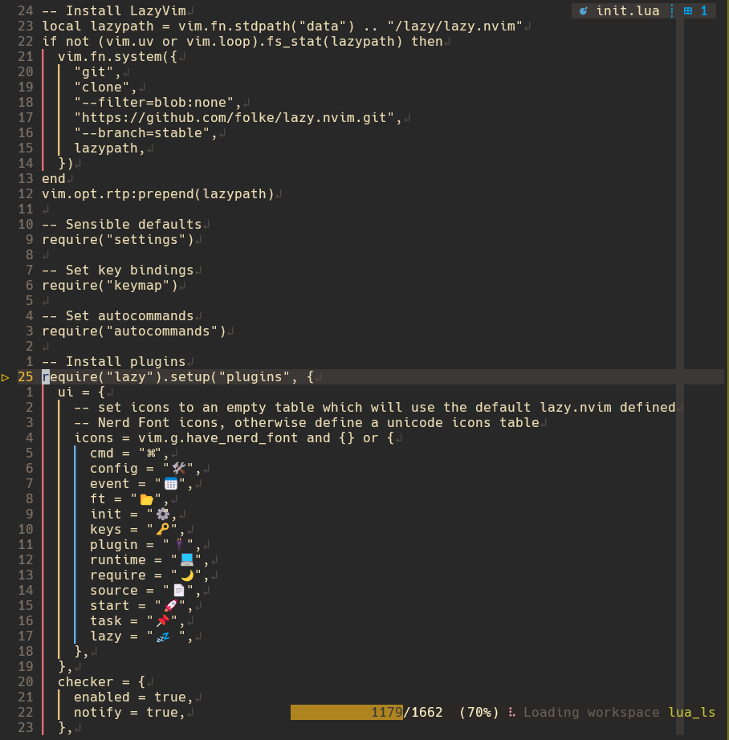

# NeoVim Dotfiles

Welcome to Taihen personal NeoVim configuration repository, specifically
tailored for minimalist infrastructure development. Optimized for NeoVim 0.11+,
experience with earlier versions may vary. Built with `lazy.nvim` and `mason`
for efficient plugin management, it aims to provide a powerful, flexible, and
visually pleasing coding environment.



## Features

- **Plugin Management:** Powered by `lazy.nvim` and
  [Mason](https://github.com/williamboman/mason.nvim), enabling automatic
  installation and updates of plugins, formatters and LSPs.
- **Custom Keybindings:** Intuitive shortcuts to improve navigation and editing
  efficiency, discoverable with
  [whichkey](https://github.com/folke/which-key.nvim).
- **Language Support:** Support for infrastructure
  development with Terraform, GoLang, Ansible, Helm, and Docker Compose. Includes
  YAML and JSON validation with SchemaStore integration, plus support for Python,
  Bash, Lua, TypeScript, and more via Mason-managed LSPs and formatters.
- **Gruvbox Material Theme:** Utilizes
  [gruvbox-material](https://github.com/sainnhe/gruvbox-material) with material
  design palette for a warm, eye-friendly color scheme that's pleasant on the
  eyes during sessions. While using with
  [Ghostty](https://github.com/ghostty-org/ghostty) or
  [Kitty](https://sw.kovidgoyal.net/kitty/) terminals, or any other terminal
  emulator that supports switching between dark and light themes, it also
  switches automatically when the system theme changes.
- **Minimalist Aesthetic:** A clean and minimalist interface with no status
  line, using [noice](https://github.com/folke/noice.nvim) and
  [telescope](https://github.com/nvim-telescope/telescope.nvim) for user
  interface, focusing on maximizing screen real estate and reducing distractions.
- **Performance Optimized:** A fast and responsive configuration, ensuring
  minimal startup time and smooth operation.
- **Enhanced Editing:** Powered by
  [mini.nvim](https://github.com/nvim-mini/mini.nvim) suite providing advanced
  text objects, surround operations, indent visualization, automatic
  whitespace management, smart buffer deletion, code movement, and split/join
  operations.
- **Clipboard Manager:** Persistent clipboard history with
  [neoclip](https://github.com/AckslD/nvim-neoclip.lua) integrated into Telescope
  for quick access to previous yanks.
- **Markdown Experience:** Terminal rendering with
  [render-markdown.nvim](https://github.com/MeanderingProgrammer/render-markdown.nvim).
- **Schema Validation:** JSON and YAML schema validation powered by
  [SchemaStore](https://github.com/b0o/schemastore.nvim) with support for custom
  schemas (e.g., Kubernetes, Helm, ArgoCD).
- **AI Enhanced Code Assistance:** Utilizing
  [Copilot](https://github.com/zbirenbaum/copilot.lua) for inline code
  completion and [Sidekick](https://github.com/folke/sidekick.nvim) for agentic
  AI assistance with CLI integration (supporting Claude, Gemini, and other AI
  agents via tmux).

## Notable Plugins

This configuration includes carefully selected plugins organized by category:

### UI & Visual Experience

- [gruvbox-material](https://github.com/sainnhe/gruvbox-material) - Material design Gruvbox variant
- [auto-dark-mode.nvim](https://github.com/f-person/auto-dark-mode.nvim) - Automatic theme switching
- [noice.nvim](https://github.com/folke/noice.nvim) - Enhanced UI for messages and cmdline
- [incline.nvim](https://github.com/b0o/incline.nvim) - Buffer information display (no statusline)
- [dressing.nvim](https://github.com/stevearc/dressing.nvim) - Enhanced vim.ui components
- [nvim-colorizer.lua](https://github.com/NvChad/nvim-colorizer.lua) - Color code highlighting
- [todo-comments.nvim](https://github.com/folke/todo-comments.nvim) - Highlight TODO/NOTE comments
- [vim-illuminate](https://github.com/RRethy/vim-illuminate) - Highlight word under cursor

### AI & Completion

- [sidekick.nvim](https://github.com/folke/sidekick.nvim) - Agentic AI assistance with CLI agents
- [copilot.lua](https://github.com/zbirenbaum/copilot.lua) - GitHub Copilot integration
- [nvim-cmp](https://github.com/hrsh7th/nvim-cmp) - Autocompletion engine
- [LuaSnip](https://github.com/L3MON4D3/LuaSnip) - Snippet engine

### LSP & Language Tools

- [mason.nvim](https://github.com/williamboman/mason.nvim) - LSP/tool installer
- [nvim-lspconfig](https://github.com/neovim/nvim-lspconfig) - LSP configurations
- [lsp-timeout.nvim](https://github.com/hinell/lsp-timeout.nvim) - Auto-restart LSP for performance
- [conform.nvim](https://github.com/stevearc/conform.nvim) - Code formatting
- [nvim-lint](https://github.com/mfussenegger/nvim-lint) - Linting and diagnostics
- [schemastore.nvim](https://github.com/b0o/schemastore.nvim) - JSON/YAML schema validation
- [nvim-treesitter](https://github.com/nvim-treesitter/nvim-treesitter) - Syntax parsing

### Navigation & Search

- [telescope.nvim](https://github.com/nvim-telescope/telescope.nvim) - Fuzzy finder
- [which-key.nvim](https://github.com/folke/which-key.nvim) - Keybinding discovery
- [trouble.nvim](https://github.com/folke/trouble.nvim) - Diagnostics and quickfix UI
- [nvim-neoclip.lua](https://github.com/AckslD/nvim-neoclip.lua) - Persistent clipboard manager

### Git Integration

- [lazygit.nvim](https://github.com/kdheepak/lazygit.nvim) - Terminal UI for Git operations
- [gitsigns.nvim](https://github.com/lewis6991/gitsigns.nvim) - Git signs and hunks
- [codediff.nvim](https://github.com/esmuellert/codediff.nvim) - VSCode-style diff viewer

### Editing Enhancement

- [mini.nvim](https://github.com/nvim-mini/mini.nvim) - Collection of independent modules:
  - mini.ai - Advanced text objects
  - mini.surround - Bracket/quote manipulation
  - mini.indentscope - Indent visualization
  - mini.trailspace - Whitespace management
  - mini.comment - Code commenting with treesitter awareness
  - mini.pairs - Auto-closing pairs
  - mini.bracketed - Enhanced navigation with bracket mappings
  - mini.bufremove - Smart buffer deletion without breaking layouts
  - mini.move - Move lines/blocks with keyboard shortcuts
  - mini.splitjoin - Toggle between single/multi-line code structures
- [vim-sleuth](https://github.com/tpope/vim-sleuth) - Auto-detect indentation

### Markdown Support

- [render-markdown.nvim](https://github.com/MeanderingProgrammer/render-markdown.nvim) - Terminal rendering

See `lua/plugins.lua` for complete list and configurations.

## Installation

### Quick Start (macOS/Linux with Homebrew)

1. **Backup Your Current Configuration**:

   ```bash
   mv ~/.config/nvim ~/.config/nvim.backup
   ```

2. **Clone the Repository**:

   ```bash
   git clone https://github.com/taihen/neovim-dotfiles.git ~/.config/nvim
   ```

3. **Install All Dependencies** (one-command setup):

   ```bash
   cd ~/.config/nvim
   ./scripts/install-dependencies.sh
   ```

   This script installs:
   - Neovim 0.11+
   - All language servers (bash, go, terraform, lua, yaml, ansible, docker, helm, markdown)
   - Formatters and linters (black, stylua, prettier, gofumpt, tflint, trivy, vale, etc.)
   - Search tools (fd, ripgrep, fzf)
   - Git tools (gh, lazygit)
   - Nerd Fonts (Hack, JetBrains Mono, Fira Code)
   - Supporting tools (sqlite, make, gcc, node, python3, go)

4. **Configure Your Terminal**: Set your terminal font to a Nerd Font (e.g.,
   "Hack Nerd Font") for proper icon rendering.

5. **Launch Neovim**: On first launch, plugins will auto-install:

   ```bash
   nvim
   ```

6. **Verify Installation**:
   ```vim
   :checkhealth          " Check for issues
   :Lazy sync            " Sync plugins
   :Mason                " Verify LSP servers installed
   ```

### Manual Installation

If you prefer manual installation or aren't using Homebrew, see the [External
Dependencies](#external-dependencies) section below for a complete list of
required tools.

## External Dependencies

The `install-dependencies.sh` script handles all these automatically on
macOS/Linux with Homebrew. For manual installation or other platforms, ensure
these are available:

- **Build Tools:** A C compiler (like `gcc` or `clang`) is required by `nvim-treesitter` to build language parsers.
- **Node.js and npm:** For JavaScript/TypeScript based plugins and language servers (e.g., `copilot.lua`, `eslint`).
- **Python3 and pip:** Required by several Python-based plugins and tools (e.g., `yamllint`, some MCP servers).
- **Rust and Cargo:** For Rust development and Rust-based plugins/tools (e.g., `ruff`).
- **GoLang:** For Go development and Go-based language servers (`gopls`).
- **Terraform CLI:** Required for Terraform language support and commands.
- **make:** Required by `telescope-fzf-native.nvim` for building the native FZF sorter.
- **sqlite3:** Required by `nvim-neoclip.lua` for persistent clipboard history.
- **tmux:** Required by `sidekick.nvim` for CLI integration and agentic workflows.
- **lazygit:** Terminal UI for Git commands, integrated via `lazygit.nvim` for enhanced Git workflows.
- **Search Utilities (Recommended):**
  - `ripgrep`: Highly recommended for fast searching in Telescope.
  - `fd`: Recommended for fast file finding in Telescope.
- **Optional (Depending on Use Case):**
  - `Docker`: May be needed if running certain tools or MCP servers in containers.
  - `shellharden`: Shell script hardening and formatting (used by conform.nvim).
  - `shfmt`: Shell script formatting (used by conform.nvim).
  - `vale`: Syntax-aware prose linting (used by nvim-lint).
  - AI Agents: `claude`, `gemini`, `codex` or `opencode` CLI tools to power `sidekick.nvim`

Ensure these dependencies are installed via your system's package manager (e.g., `apt`, `brew`, `pacman`).

## Customization

Feel free to modify and customize the configuration to suit your preferences.
The `init.lua` file is the starting point, but most of the configuration is in
`./lua/` where you can change key mappings, themes, and plugins.

## Contributing

Contributions are welcome. This is never ending work in progress and never
expect to be perfect. If you have improvements or corrections, please submit a
pull request. Thank you in advance.

## License

This NeoVim configuration, feel free to do whatever. Have fun, copy, and
paste parts of it to your likening.
